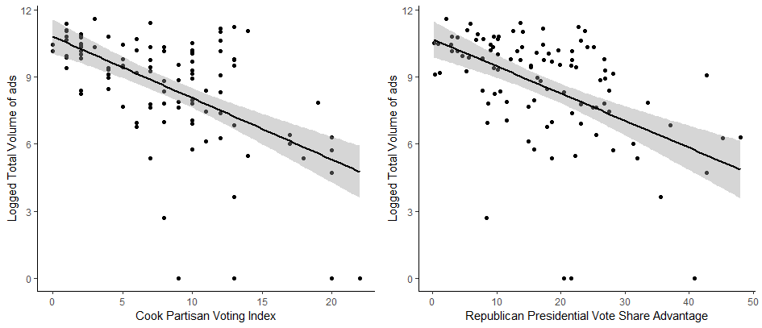
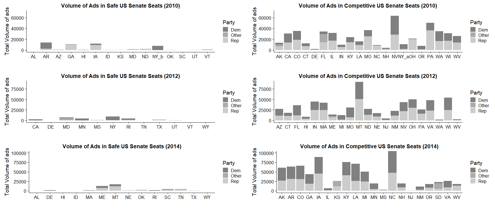
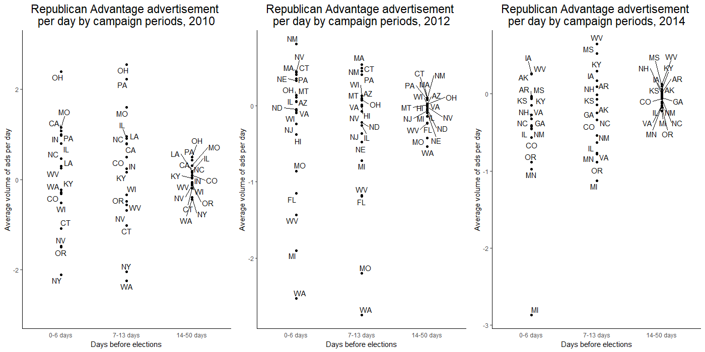
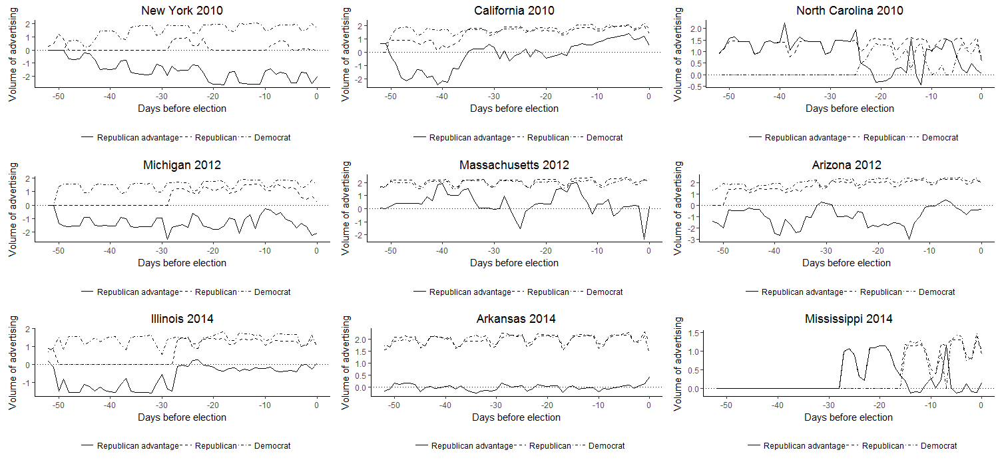
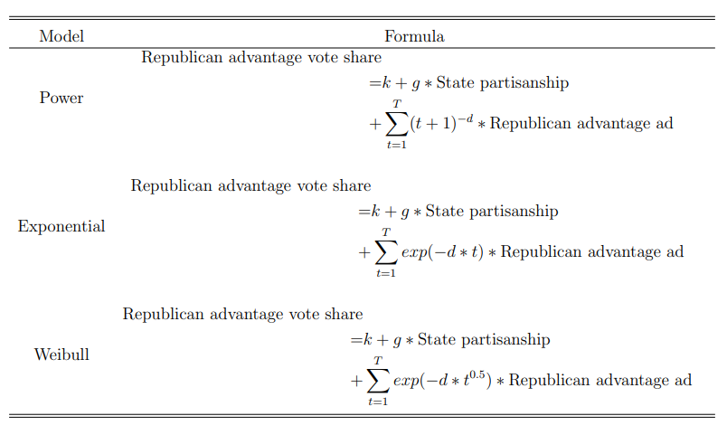
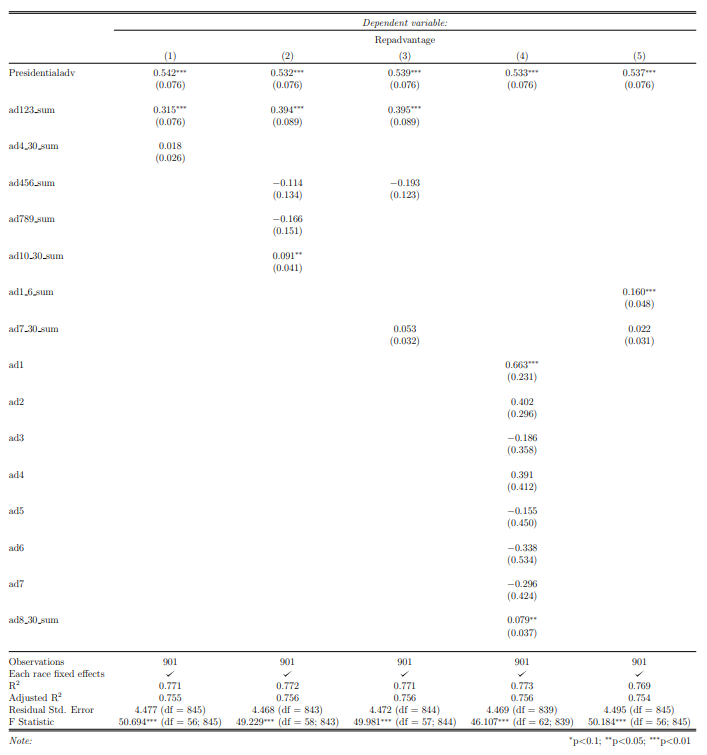
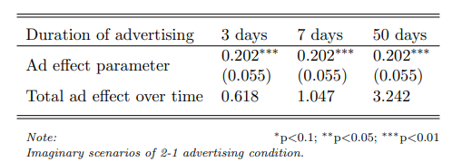

# Motivation

Television advertising is the mainstay form of communication in most major elections in the United States and many other democracies, but despite its importance, existing research leaves a big question unanswered: Do the effects of advertising last more than a few days? It is important because most advertising is run weeks or months ahead of election day, which would be hugely wasteful if, as some research suggests, the effects decay rapidly.

To answer this question, I have conducted a time series analysis of 901 polls conducted in the general election phase of 54 Senate elections in 2010, 2012 and 2014.  My results provide the strongest support to date for the view that the effects of typical advertising in subnational elections – that is, elections below the level of president – decay rapidly.

# Short-lived effects of mass communication

Scholars argue that mass communication cannot exert durable persuasion effects, but until recently, scholars have not investigated how quickly the effects decay and why mass communication cannot bring about durable effects. For instance, one of the outstanding early studies is Fox news study by Della Vigna and Kaplan (2007). The study finds that mass media influences voting behaviors by studying natural experiments of introducing Fox news in cable markets, and they observed that the media effects disappear over time (DellaVigna and Kaplan 2007). 

In the only other study of duration of advertising effects, Hill et al. (2013) adopted memory and persuasion theories from Hastie and Park (1986) and used memory-based, online-based, and dual process model to theoretically explain short-lived effects of mass communication. The key findings of Hill et al. (2013) showed that the dual-process model of communication, which is a mixed version of memory and online process, could explain short-lived effects of mass communication because most voters engage campaign communication with non-effortful memory process. However, even if most recipients cared less about the information from the campaign advertising, some would accept campaign messages with an effortful information process the effects of which can last longer (Hill et al. 2013, 525). 

# Campaigns, advertising and closeness of elections
As Caughey and Sekhon (2011) summarize and Enos and Hersh (2015) point out, close elections are different from other elections in many aspects, and they have some distinctive characteristics. However, the main reason that I need to focus on competitive races (battlegrounds) to study advertising effects is these races are where the “real” campaigns and campaign advertising exist and the election outcomes of the states where they have strong partisanship regardless of advertising. To examine effects of campaigns, particularly campaign advertising, I need to study the races where the “real” campaigns ran from both candidates and the both candidates have a feasible chance to win an election. As RealClearPolitics.com shows, about 40 percent (41 out of 103) of 2010, 2012 and 2014 Senate elections were safe seats. 

 
# Overview of data
However, is it really true that there is a notable difference in activeness of campaigns including advertising between competitive and uncompetitive elections? Therefore, I briefly examine the relationships between competitiveness of elections and activeness of campaigns. There are several indicators that can be used as a measurement of campaign intensity, although it is difficult to “measure” campaign intensity. Westlye studies Senate elections and campaign intensity, and he argues that margin of victory, quantity of news coverage, volume of advertising, candidate’s expenditure and Congressional Qaurterly’s evaluations can be used as a measurement of campaign intensity (1991). However, in this paper, I use state partisanship as Cook Partisan Voting Index (Cook PVI) for a proxy to represent competitiveness of an election and total volume of TV ads in all candidates during general elections for the Senate to show campaign intensity.

As shown in Figure 1, there is a clear negative relationship between partisanship and total volume of TV advertisements\footnote{I used absolute values of Cook PVI for each state: Hawaii’s 2014 Cook PVI is D$+$20 and Wyoming’s 2010 Cook PVI is R$+$20. In Figure 1, they are both 20 in the X axis.). Dependent variable which is the volume of ads is logged sum of entire advertising for general elections.}. It strongly implies that there is a negative relationship between electoral competitiveness and campaign activeness. In other words, competitive races are more likely to have active campaigns, and races for safe seats are unlikely to have active campaigns. 

Figure 2 also shows that relationship. The right panel is competitive races based on RealClearPolitics’s Senate battleground map including “Leans Republican/Democrat”, “Likely Republican/Democrat” and “Toss up” races. These races have much larger volume of advertisements compared to the left panel of Figure 2 which is the races for “Safe” seats. Figure 2 shows that in competitive races of winnable seats, both candidates actually ran heavy campaign advertising. On the other hand, in the races for safe seats, “real” campaigns with TV advertising rarely exist. Therefore, it is unsuitable to study races for safe seats to examine advertising effects because they virtually do not have campaigns and campaign advertising.

Polls plays two crucial roles in this study. They are the main dependent variables, and at the same time, they were important controls that can support causal claims of my arguments. First, I will explain how statistical models deal with these polls and election outcomes. 

The main explanatory variable, advertisement, is the number of daily ads broadcasted in each state. To acquire a more realistic analysis, ads are weighted by state population coverage of media market size. The weights are calculated based on Nielson media market 2010, 2012 and 2014 TV household Designated Market Area (DMA). (A clear example is the Hawaii media market that only has one media market. In this case, Honolulu DMA is weighted by 1. On the other hand, New York’s DMA weights are more complicated because New York is covered by 12 different DMAs, and these DMAs also cover other states.) In my study, I focus on the number of ads ran in each state. Because my main dependent variables are state-level polls, and with these polls, it is impossible to estimate how many times the targeted house household watched advertisements. In other words, in this study, estimating GRPs is not available. Rather, my main explanatory variable, advertisement, is simply a daily count of ads in each DMA, and I weight them by the size of DMA in each state.

The final version of ad variable is logged Republican advantage advertisement. This format of the independent variable is accordance with the dependent variable, which is Republican advantage point in polls. Let us suppose that after the ads are weighted by media markets, the weighted value is 100, indicating that there are 100 advertisements for a Republican candidate in a day. The 100 ads will be transformed to natural log of (100 + 1). Like the Republican case, let us suppose the weighted value of ads for a Democrat candidate is 50, indicating 50 ads for a Democrat candidate in that day. Then, it will be transformed to natural log of (50 + 1). Finally, that day’s ad variable will be about 0.68 (4.61 - 3.93). It means that a Republican candidate has 0.68 logged advertisement advantage over a Democrat candidate on that day. 

Figure 3 shows the average Republican advantage advertisement during campaigns by election years. Near actual elections, it seems that there are more ads. I divide campaign period into three to represent advertising volume (Republican advertisement advantage) over time. Negative value of Republican advertising advantage means that Democrat candidate has advertising advantage. The gap between candidates is at most about 3 logged advertisements on average; hence, one side is not dominating in terms of advertising. 

Figure 4 shows some competitive races’ dynamics of advertising during campaigns, illustrating on daily basis. In the next section, I discuss in detail the models and variables.  

# Method
  # Block model: simple model for the decay of advertising effects
I start my analysis with a simple linear model, followed by non-linear closed-form decay models to estimate the decay of advertising effects.  Following the study by Hill et al., I begin with a linear model employing blocks of advertising in order to find the basic pattern of decay (2013). I sum daily advertising into blocks of various lengths and examine these blocks against each other (e.g., effect of the first 3 days of ads versus the effect of next 27 days). To be specific, the blocks are aggregates of logged advertisements’ net differences in given periods. Block models are flexible in their modeling because of various lengths that can capture general patterns of decay.  

The block model is basically OLS. The dependent variable is Republican advantage vote share (Republican vote share – Democrat vote share). The main explanatory variable is logged Republican advantage advertisements (log of number of Republican ad plus 1 - log of number of Democrat ad plus 1) representing net advertising difference between Republican and Democrat candidates. One of the block models that I used is:

From block models, I found strong patterns of decaying effects, and the patterns imply possible application of more sophisticated closed-form decay models with finer-grained decay patterns of daily advertising. 

 # Decay models: estimating initial advertising impact and decay rate
Decay model examine how well the data fits a given function, and the results are estimated parameters of ad impact and decay rate. Closed-form decay models in this paper are Exponential, Weibull and Power models, as used by Hill et al. (2013). I test all three models to check whether the models fit the data well. However, I select Weibull model as my main model, which is the median model among the three to analyze outcomes in detail. Same as block models, decay models’ dependent variable is Republican advantage vote share, and the main explanatory variable is Republican advantage ads. Table 2 shows the decay models with several parameters, specifically, “k” is an intercept, “g” is state partisanship (Republican presidential vote share – Democrat presidential vote share), and “i” is the initial impact of advertising on the day of advertising. The initial impact “i” decays over time by the rate of “d”, which is a decay rate of initial impact over time “t”. 

# Results
  # Block models
  

  
  
  # Decay models

