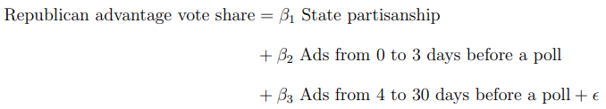
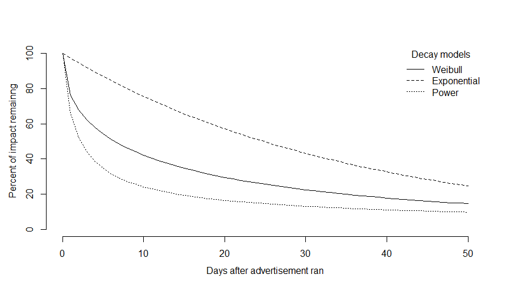
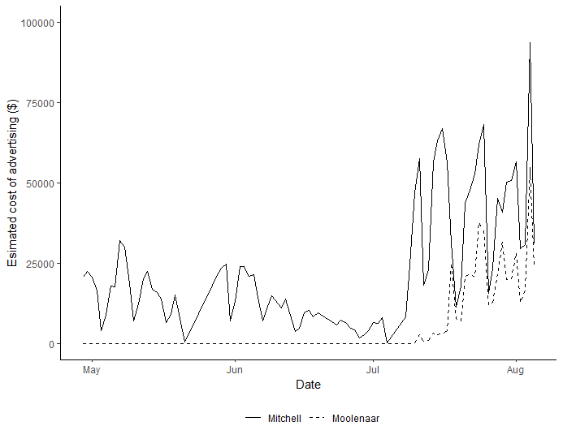

# Motivation

Television advertising is the mainstay form of communication in most major elections in the United States and many other democracies, but despite its importance, existing research leaves a big question unanswered: Do the effects of advertising last more than a few days? It is important because most advertising is run weeks or months ahead of election day, which would be hugely wasteful if, as some research suggests, the effects decay rapidly.

To answer this question, I have conducted a time series analysis of 901 polls conducted in the general election phase of 54 Senate elections in 2010, 2012 and 2014. My results provide the strongest support to date for the view that the effects of typical advertising in subnational elections – that is, elections below the level of president – decay rapidly.

* The R file for decay models can be found [here](https://github.com/HungryLim/The-effects-and-duration-of-political-advertising/blob/master/decaymodel.R). Anohter model example for electoral behavior analysis can be found [here](https://github.com/HungryLim/The-effects-and-duration-of-political-advertising/blob/master/Data%20analysis.R).
* The full paper (report) can is attached [here](https://github.com/HungryLim/The-effects-and-duration-of-political-advertising/blob/master/Decay_paper.pdf).

# Short-lived effects of mass communication

Scholars argue that mass communication cannot exert durable persuasion effects, but until recently, scholars have not investigated how quickly the effects decay and why mass communication cannot bring about durable effects. Hill et al. (2013) adopted memory and persuasion theories from Hastie and Park (1986) and used memory-based, online-based, and dual process model to theoretically explain short-lived effects of mass communication. The key findings of Hill et al. (2013) showed that the dual-process model of communication, which is a mixed version of memory and online process, could explain short-lived effects of mass communication because most voters engage campaign communication with non-effortful memory process. However, even if most recipients cared less about the information from the campaign advertising, some would accept campaign messages with an effortful information process the effects of which can last longer (Hill et al. 2013, 525). 

# Campaigns, advertising and closeness of elections
As Caughey and Sekhon (2011) summarize and Enos and Hersh (2015) point out, close elections are different from other elections in many aspects, and they have some distinctive characteristics. However, the main reason that I need to focus on competitive races (battlegrounds) to study advertising effects is these races are where the “real” campaigns and campaign advertising exist and the election outcomes of the states where they have strong partisanship regardless of advertising. To examine effects of campaigns, particularly campaign advertising, I need to study the races where the “real” campaigns ran from both candidates and the both candidates have a feasible chance to win an election. As RealClearPolitics.com shows, about 40 percent (41 out of 103) of 2010, 2012 and 2014 Senate elections were safe seats. 

 
# Overview of data
However, is it really true that there is a notable difference in activeness of campaigns including advertising between competitive and uncompetitive elections? Therefore, I briefly examine the relationships between competitiveness of elections and activeness of campaigns. There are several indicators that can be used as a measurement of campaign intensity, although it is difficult to “measure” campaign intensity. Westlye studies Senate elections and campaign intensity, and he argues that margin of victory, quantity of news coverage, volume of advertising, candidate’s expenditure and Congressional Qaurterly’s evaluations can be used as a measurement of campaign intensity (1991). However, in this paper, I use state partisanship as Cook Partisan Voting Index (Cook PVI) for a proxy to represent competitiveness of an election and total volume of TV ads in all candidates during general elections for the Senate to show campaign intensity.

As shown in the below figure, there is a clear negative relationship between partisanship and total volume of TV advertisements. It strongly implies that there is a negative relationship between electoral competitiveness and campaign activeness. In other words, competitive races are more likely to have active campaigns, and races for safe seats are unlikely to have active campaigns. 

Polls plays two crucial roles in this study. They are the main dependent variables, and at the same time, they were important controls that can support causal claims of my arguments (lagged dependent variables). For this study, I used RealClearPolitics state-level polls of U.S. Senate races. Polls and election outcomes from 54 U.S. competitive Senate races are selected, specifically, 17 races in 2010, 20 races in 2012, and 17 races in 2014, totaling 847 polls and 54 actual election outcomes.

The main explanatory variable, advertisement, is the number of daily ads broadcasted in each state. To acquire a more realistic analysis, ads are weighted by state population coverage of media market size. The weights are calculated based on Nielson media market 2010, 2012 and 2014 TV household Designated Market Area (DMA). (A clear example is the Hawaii media market that only has one media market. In this case, Honolulu DMA is weighted by 1. On the other hand, New York’s DMA weights are more complicated because New York is covered by 12 different DMAs, and these DMAs also cover other states.) In my study, I focus on the number of ads ran in each state. The main explanatory variable, advertisement, is simply a daily count of ads in each DMA, and I weight them by the size of DMA in each state.

The final version of ad variable is logged Republican advantage advertisement. This format of the independent variable is accordance with the dependent variable, which is Republican advantage point in polls. Let us suppose that after the ads are weighted by media markets, the weighted value is 100, indicating that there are 100 advertisements for a Republican candidate in a day. The 100 ads will be transformed to natural log of (100 + 1). Like the Republican case, let us suppose the weighted value of ads for a Democrat candidate is 50, indicating 50 ads for a Democrat candidate in that day. Then, it will be transformed to natural log of (50 + 1). Finally, that day’s ad variable will be about 0.68 (4.61 - 3.93). It means that a Republican candidate has 0.68 logged advertisement advantage over a Democrat candidate on that day. 

The below figure shows the average Republican advantage advertisement during campaigns by election years. Near actual elections, it seems that there are more ads. I divide campaign period into three to represent advertising volume (Republican advertisement advantage) over time. Negative value of Republican advertising advantage means that Democrat candidate has advertising advantage. The gap between candidates is at most about 3 logged advertisements on average; hence, one side is not dominating in terms of advertising. 

The below figure shows some competitive races’ dynamics of advertising during campaigns, illustrating on daily basis. In the next section, I discuss in detail the models and variables.  

# Method
  # Block model: simple model for the decay of advertising effects
I start my analysis with a simple linear model, followed by non-linear closed-form decay models to estimate the decay of advertising effects. Following the study by Hill et al., I begin with a linear model employing blocks of advertising in order to find the basic pattern of decay (2013). I sum daily advertising into blocks of various lengths and examine these blocks against each other (e.g., effect of the first 3 days of ads versus the effect of next 27 days). To be specific, the blocks are aggregates of logged advertisements’ net differences in given periods. Block models are flexible in their modeling because of various lengths that can capture general patterns of decay.  

The block model is basically OLS. The dependent variable is Republican advantage vote share (Republican vote share – Democrat vote share). The main explanatory variable is logged Republican advantage advertisements (log of number of Republican ad plus 1 - log of number of Democrat ad plus 1) representing net advertising difference between Republican and Democrat candidates. One of the block models that I used is:

The next strategy to identify the effect of advertising is more sophisticated closed-form decay models with finer-grained decay patterns of daily advertising. 

 # Decay models: estimating initial advertising impact and decay rate
Decay model examine how well the data fits a given function, and the results are estimated parameters of ad impact and decay rate. Closed-form decay models in this paper are Exponential, Weibull and Power models, as used by Hill et al. (2013). I test all three models to check whether the models fit the data well. However, I select Weibull model as my main model, which is the median model among the three to analyze outcomes in detail. Same as block models, decay models’ dependent variable is Republican advantage vote share, and the main explanatory variable is Republican advantage ads. The below table shows the decay models with several parameters, specifically, “k” is an intercept, “g” is state partisanship (Republican presidential vote share – Democrat presidential vote share), and “i” is the initial impact of advertising on the day of advertising. The initial impact “i” decays over time by the rate of “d”, which is a decay rate of initial impact over time “t”. 

# Results
  # Block models
Block models can show general patterns of advertising effect decay. The ad variables represent the sum of net difference of logged ads in the period described.

  

In column 1, there are two groups (blocks) of ads. The results show that the sum of advertising 2 days before polls have statistically significant effects (three days including the day of polling) while the remaining ad blocks, the sum of advertising from 3 days before polls to 30 days before polls have no significant effects. In every different combinations of different ad blocks, ads more than a week before elections do not have significant effects on polls and elections. It implies that advertising a week before elections is not effective. The main takeaway from the decay model can be found from column 4: advertising a day before is only effective. It means advertising effect decays “very” quickly. 

On the other hand, there are several interesting findings from the block models. In column 2 and 3, the coefficient of ads 3 to 5 days before polls is negative, -0.25 and -0.22 respectively, and they statistically significant. In column 4, advertising on the day of polls and elections is not significant, but only the advertising a day before polls and elections holds statistical significance. These findings leave two questions: First, is it really true that advertising a day before polls and elections has no effects? Second, do ads 3 to 5 days before polls and elections have negative effects? I believe the interpretations of these results in column 2, 3 and 4 are not straightforward due to a problem with the polls in my study. As discussed, the last day of poll is set as a poll day; therefore, I believe more reasonable interpretations are advertising only a few days before polls and elections has effects. Overall, the findings from block models are consistent with the results from Hill et. al.’s paper in that in the subnational elections, the effect of TV campaign advertising decays rapidly (2013). 

To sum up, the key finding from block models are even if these models show different size of effect, we can clearly observe that advertising only a few days before polls and elections has significant effects. Early advertising is ineffective and advertising only a few days before polls and elections are effective. Possibly, advertising could be only effective for a day or two. From block model, I observe strong patterns of decay, so now I will explain a closed-form decay model to measure decay rates of communication effects.

  # Decay models
Different from block model, decay model can estimate the effect of daily advertising more accurately. For decay model, the net difference in advertising per day is required, which is log of Republican number of ad (plus 1) minus log of Democrat number of ad (plus 1) for each day. Advertising effects can be interpreted in two ways: First, the decay model’s advertising impact parameter is the size of advertising effect on the day of advertising. Second, to check the total advertising effects for the given time, the advertising impact should be weighted by decay parameter in the decay model, and I need to sum the weighted advertising impact for the given period of time. For instance, in this paper, I include 50 days of advertising for each polls and elections to estimate decay models’ parameters (including the day of polling) and to understand total effects of advertising for 50 days, I need to sum initial advertising impacts weighted by decay parameter. Hill et al. (2013) state that each decay model has unique mathematical properties; however, I independently choose Weibull model as my main model in this paper, although I test all three models with the data (2013a, 534). My aim in this section is to investigate more precise decay rates and the effect of advertising with the given data.

Table 5 shows the outcomes of the accumulated data of 2010, 2012 and 2014. There are two main findings: the size of initial advertising effects (impacts) and decay rates of the initial impact. At first, the size of advertising effects is about 0.67 on the day of advertising; if a candidate has one logged advertisement advantage on the day of advertising, the candidate’s vote share increases about 0.67 percent according to Weibull model. This initial impact decrease rapidly and to understand the speed of decay, I need to visualize decay rate. Figure 6 visualizes the decaying effects based on Table 5. The figure 6 shows the remaining percentage of initial advertising impact after the ad runs from day 0, and it clearly shows the fast decay of initial impact. A day after advertising, the advertising effects drop rapidly that only about a half of the initial effects left. After 5 days, about 10 percent of initial effect remains and after 20 days, only about 5 percent of the initial effect remained according to Weibull model. This rapid decay rate follows the findings of decay pattern from block models.

We could compare three models (Exponential, Power and Weibull) with their log-likelihood. Among three, Power model shows the best fit, but their differences are marginal. Exponential model shows stable statistical significance in all estimated parameters at 0.05 level and the next is power model. Weibull model holds statistical significance in decay parameter, but initial ad impact parameter’s standard errors include zero. Although Weibull model does not hold statistical significance in all parameters, as stated, I chose Weibull model to explain my findings because it is the median among three models. 
  

\subsection*{Estimating total advertising effects}
I explained the decay rates and initial ad impacts from decay model. However, in addition to the analysis of estimated parameters, I need to explain how these decaying effects can be understood as a total effect over time. Therefore, I estimate and illustrate the size of advertising effects over time when advertisements are run continuously during campaigns in table 7. Let us suppose that Republican candidate has advantage of one logged advertisement per day over a Democrat candidate for 3 days, 7 days, and 50 days. According to Weibull model, in a scenario of 50 days of advertising, total effect of 50 days of advertising is about three times larger compared to the total effect of 3 days of advertising as shown in table 7. The difference of about 2.11 percent vote share is substantial, and it can change an election outcome. However, considering the difference between 3 days and 50 days of advertising, 0.98 percent vote share advantage of Republican candidate can be regarded as a marginal difference. This becomes clear when I compare 3 days and 7 days of advertising, and 3 days and 50 days of advertising. Four more days of advertising brings about 0.43 (1.56 – 1.13) percent advantage in vote share. However, 47 days of more advertising only results in about 0.98 (2.11 – 1.13) percent more advantage in vote share. The diminishing effects of advertising over time mean that advertising long before an election is highly ineffective. This finding suggests limitation of campaign advertising effects and importance of campaign strategies that late advertising advantage can easily outweigh early advertising advantage (Hill et al. 2013).

\subsection*{Importance of findings }
There are three important findings in the context of campaigns. First, as Hill et al.’s study shows, my finding is a good news for a relatively underfunded candidate because advertising effects on elections are somewhat limited that early advertising has almost no effect or very minimal effects (2013). In other words, political money has somewhat limited effects on elections. Also a candidate may save the money for early advertising to use it for a sprint finish because late advertising can override early advertising in competitive races. 

An exemplary real word case can be the Republican nomination in Michigan 4th district 2014. A millionaire candidate, Paul Mitchell outspent John Moolenaar about \$3.65 million to \$1.25 million, but Mitchell lost in the election. The interesting point is Mitchell had advertised starting from early campaign which is April, but Moolenaar started advertising in the mid July which is less than a month before the election date. A poll conducted by Practical EPIC-MRA on July 12th to 13th shows that Paul Mitchell (50\%) is ahead of Moolenaar (23\%) by 27 percent, and this is a big margin. However, the actual election outcome was the opposite. There can be many stories and other factors behind this surprising election outcome. For instance, it was a primary not a general election and there were different groups behind of these two candidates in that Mitchell was a Tea party candidate and Moolenaar was the Chamber of Commerce candidate. However, one of the most important points is, early advertising is ineffective, so Mitchell wasted lots of money in early campaigning. As figure 8 shows, from April 29th to July 10th, Mitchell spent \$ 0.87 million that is about 40\% of his total spending on TV advertising but Moolenaar spent “nothing”. Starting from July 10th, Moolenaar began his advertising.\footnote{I used the daily estimated cost of advertising made by Wesleyan Media Project for spending of advertising.} Therefore, as my finding argues, less-funded candidates could have a chance to defeat well-funded candidates by spending money strategically. However, more studies are required to understand the rapid decay of advertising effects in different settings and conditions. 

Second, advertising has significant effects on competitive races. Campaign advertising itself could not change the outcomes of elections probably in most cases. It is most likely because there are many safe seats in U.S. subnational elections, and the races for these safe seats are not accompanied with active campaigns. More than a half of U.S. Senate elections in 2010, 2012 and 2014 were safe seats. It is an empirical and theoretical question whether uncompetitive races and vanishing marginals in elections mean the declines of healthy vigorous democracy or not; however, competitive campaigns and elections are an important feature of democracy (Barrilleaux, Holbrook, and Langer 2002; Enos and Hersh 2015; Fiorina 1977; Holbrook and Dunk 1993; Mayhew 1974; Squire 2000). In competitive subnational races, my findings show that advertising has short-lived but substantial effects on winning votes. However, one could argue that my findings have limitations in that I “only” study competitive races accompanied with active campaigns. Indeed, in many uncompetitive races, campaign advertising may not have significant effects. It is because competitive elections have several important features. The competitive races have real campaigns and more media coverage; voters could be more mobilized and have better knowledge about the elections, and show higher turnout (Geys 2006; Jackson 1996; Sides, Brady, and Johnston 2006; Stone, Maisel, and Maestas 2004; M. C. Westlye 1983). In this regard, my findings may not be applied to uncompetitive races where the winners of races are almost predetermined without proper campaigns. However, I argue that those uncompetitive races cannot be a good subject for a study of campaign and campaign advertising simply because they are not there.

TV Advertising could have made a crucial difference in close races in close races. In 2010, Michael Bennet won the election by 0.9 percent vote share in Colorado senate race, in 2012, Heitkamp won the senate seat of North Dakota by 0.9 percent vote share, and in 2014 Warner barely defeated Gillespie by 0.8 percent vote share in Virginia. It means the defeated could have won if they had three logged advertising advantage on the day of elections. Indeed, advertising itself may not determine a winner of a race, as many other factors can have greater effects on elections. However, in a close race, advertising near elections can change the election outcomes.
Lastly, my findings also suggest that voters may not engage elections and campaigns with thoughtful attentions (Hill et al. 2013). Because advertising has short-lived and substantial effects, it is doubtful whether voters actually receive and learn messages and information from candidates’ campaigns. However, on the other hand, it is not surprising if voters do not take 30 seconds length ads seriously. Maybe voters are affected by ads without knowing (cognitively), and that is the mechanism that advertising affects voters. Voters may engage in other types of political communication such as in-person canvassing, media coverage or Facebook posts differently, more seriously.

